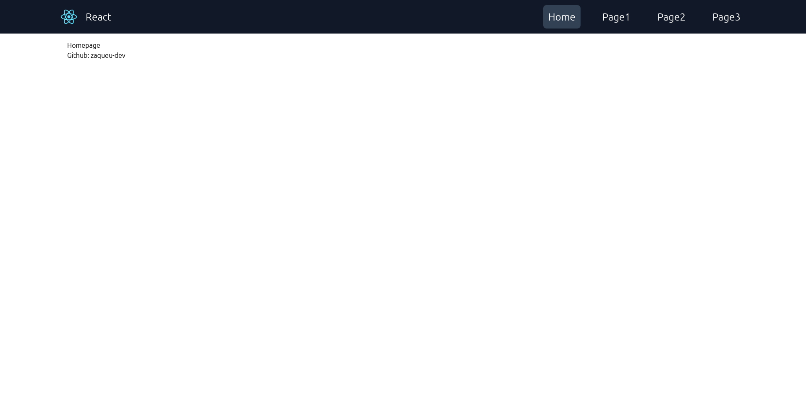
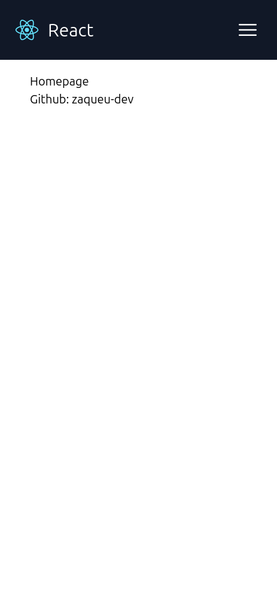

This is a default react template for initiating a new project. It has a default responsive navbar, which you can customise however you want.
Stop worrying about starting always from scratch and go straight forward to your ideas :)

It is written in Javascript, not Typescript, using Tailwind framework, you can customise it fully however you want, and also there is a default folder structure for any React project start.

